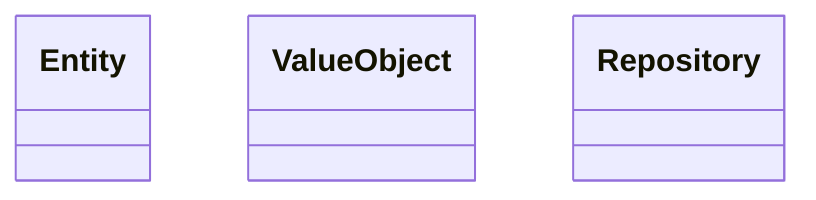

# Domain Model

## Bounded Context
TODO

```mermaid
classDiagram
    class Entity
    class ValueObject
    class Repository
```

| ID | Rule | Related Requirement |
|---|---|---|
| DES-DOM-001 | TODO | REQ-F-001 |
