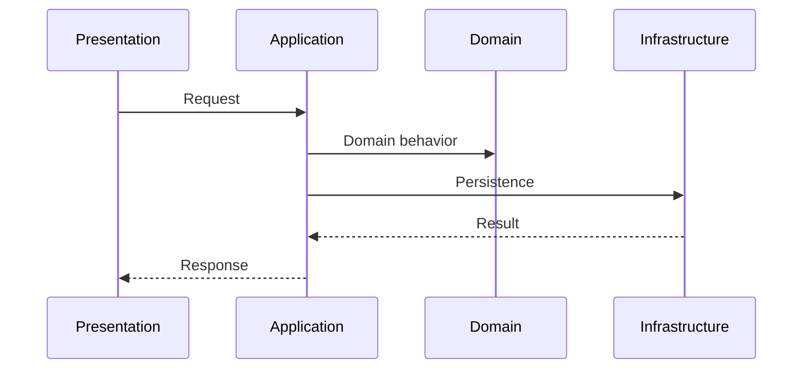

# DES-APP-001: Application Use Case

## Related Requirements
- REQ-F-001

## Input
TODO

## Output
TODO

```mermaid
sequenceDiagram
    participant P as Presentation
    participant A as Application
    participant D as Domain
    participant I as Infrastructure
    P->>A: Request
    A->>D: Domain behavior
    A->>I: Persistence
    I-->>A: Result
    A-->>P: Response
```
