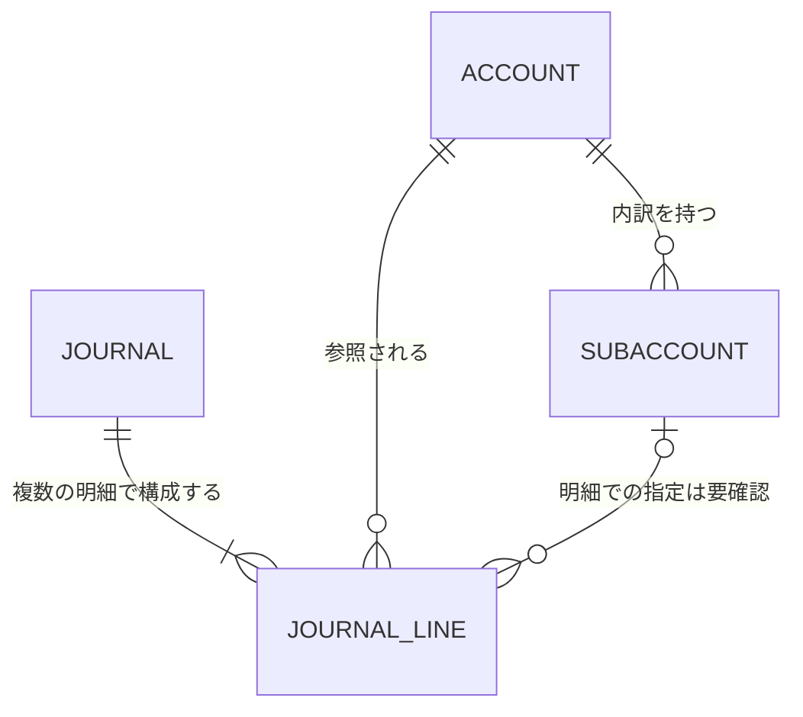

# ER図

以下はドメイン要件から導いた論理ER図であり、物理テーブルや列定義を確定するものではない。補助科目を仕訳明細に記録するかは未確定である。

```mermaid
erDiagram
    JOURNAL ||--|{ JOURNAL_LINE : "複数の明細で構成する"
    ACCOUNT ||--o{ JOURNAL_LINE : "参照される"
    ACCOUNT ||--o{ SUBACCOUNT : "内訳を持つ"
    SUBACCOUNT o|--o{ JOURNAL_LINE : "明細での指定は要確認"
```

仕訳明細を共通構造とし、借方・貸方ごとに別テーブルを設けない。借方・貸方の区分属性および具体的な属性・キーは未確定。
