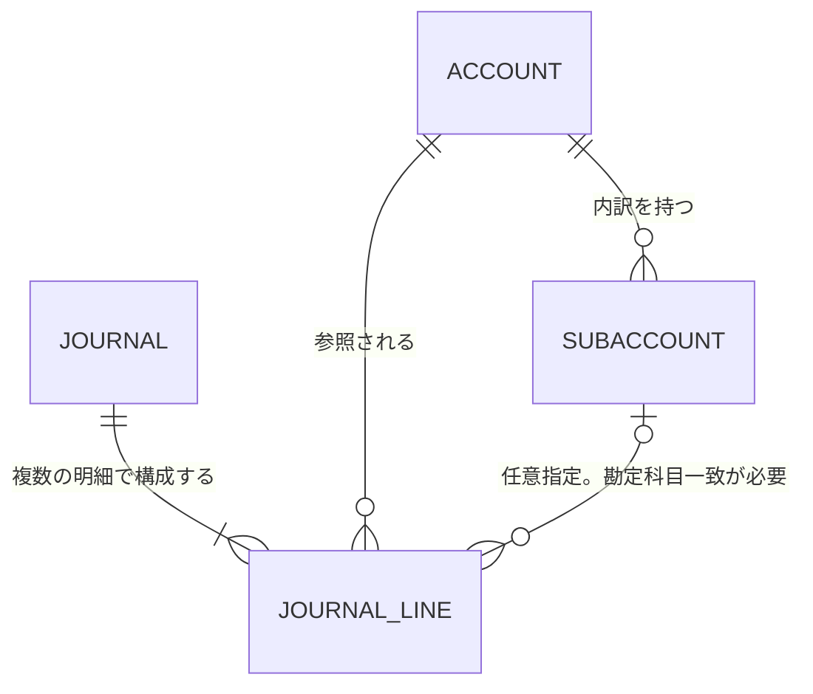

# ER図

以下はドメイン要件から導いた論理ER図であり、物理テーブルや列定義を確定するものではない。補助科目は仕訳明細ごとに任意で指定できる。

```mermaid
erDiagram
    JOURNAL ||--|{ JOURNAL_LINE : "複数の明細で構成する"
    ACCOUNT ||--o{ JOURNAL_LINE : "参照される"
    ACCOUNT ||--o{ SUBACCOUNT : "内訳を持つ"
    SUBACCOUNT o|--o{ JOURNAL_LINE : "任意指定。勘定科目一致が必要"
```

仕訳明細を共通構造とし、借方・貸方ごとに別テーブルを設けない。補助科目を指定する場合、仕訳明細の勘定科目と補助科目の親勘定科目が一致する。
