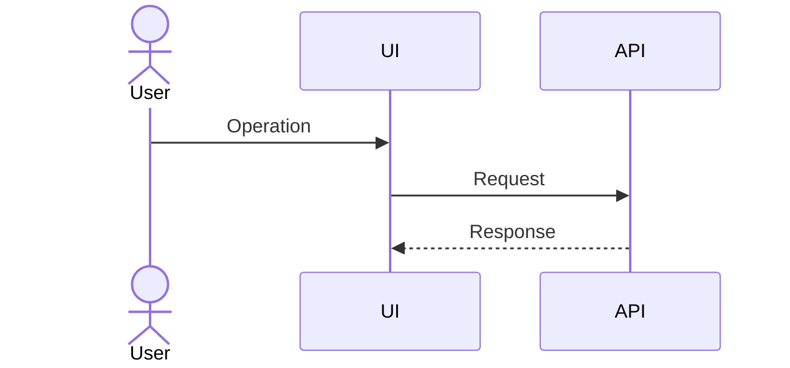

# UC-001: ユースケース名

## 目的
TODO

## アクター
TODO

## 関連要件
- REQ-F-001

## 前提条件
TODO

## 基本フロー
1. TODO
2. TODO

## 代替・例外フロー
- TODO

## 受入条件
- TODO

```mermaid
sequenceDiagram
    actor User
    participant UI
    participant API
    User->>UI: Operation
    UI->>API: Request
    API-->>UI: Response
```
