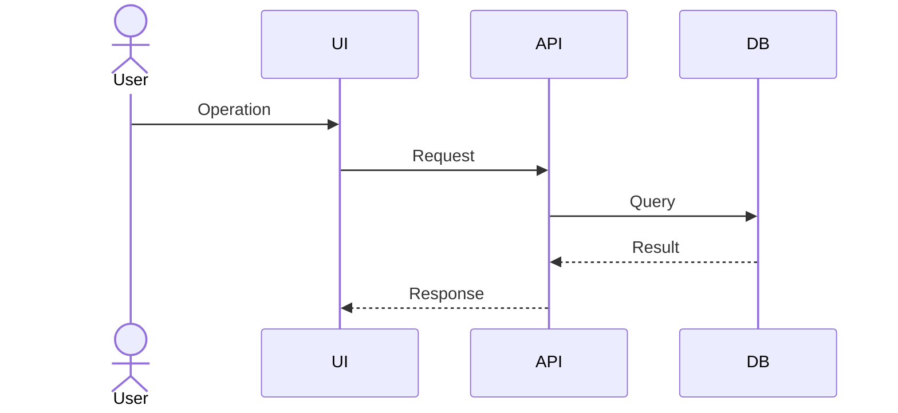

# IT-001: Integration Test Specification

## Scenario
TODO

## Related
- REQ-F-001
- UC-001

## Steps
1. TODO
2. TODO

## Expected Result
TODO

```mermaid
sequenceDiagram
    actor User
    participant UI
    participant API
    participant DB
    User->>UI: Operation
    UI->>API: Request
    API->>DB: Query
    DB-->>API: Result
    API-->>UI: Response
```
